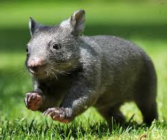

## Arrays and String Processing

### Aims and Objectives

This laboratory has been designed to help you to gain more experience in storing, retrieving and manipulating data
stored in arrays.

### Background

During this practical you will develop an event logging program for **wombat detection**. An event recorder, as
represented by the class `Recorder`, has a _position_ (_x,y coordinates_), a _name_
and a _list_ of event times (represented as an _**array of Strings**_).

The starting point is a basic version of the class `Recorder` and a class containing a **main** method which creates
a `Recorder` object and invokes some of its methods.



### Getting Started

This practical initially contains two files: `RecordEvents.java` which contains the **main** method, and `Recorder.java`
a java class.

Carefully read the program taking special note of the comments and ensure how it works.  
```java
// Program to record the times at which events occur at a number of
// locations. No continuity or error checking is performed.

//RecordEvents creates a single recorder, records 2 events
// and prints out the complete list of events
public class RecordEvents {

   public static void main(String[] args) {

      Recorder r1 = new Recorder(100, 100, "Wombat Detection");
        r1.recordEvent("10:53");
        r1.recordEvent("10:59");
        r1.printEvents();
    }
}

// A Recorder object can store up to 5 events
// The time of each event is stored as a string
// The constructor receives the coordinates of the recorder and the name
// of the event type as parameters

public class Recorder {

    int xPos, yPos;
    String eventType;
    String[] event = new String[5];

    int xevent = 0;  // keeps track of how many events have occurred

    Recorder(int xPos, int yPos, String eventType) {
        this.xPos = xPos;
        this.yPos = yPos;
        this.eventType = eventType;
    }

    public void recordEvent(String eventTime) {
        event[xevent] = eventTime;
        xevent++;
    }

    public void printEvents() {
        System.out.println("Record of " + eventType
                + " events at [" + xPos + "," + yPos + "]");

        // Task 1:
        // Add a for loop below this line to print out each event (see Task 1 spec)
        // Note that not all 5 elements of the array are necessarily used
        // The variable xevent is always one bigger than the index of the last
        // event recorded. For example, after two events have been recorded (as
        // in the main method above) the value of xevent will be 2 .
    }
}
```

###Task 1
Add a for loop to the method printEvents to print out each event (see last 2 lines of the example below).  
Run the program. The output produced should be:  <br><br>
**<tt>Record of Wombat Detection events at [100,100]  
Event number 0 was recorded at 10:53  
Event number 1 was recorded at 10:59</tt>**  
---
###Checkpoint 37
Have the program source code and output marked by a demonstrator

---

###Task 2
1. Modify the program from Task 1 so that
   1. the length of the array event is specified with a constant (a _final int_) called `EVENT_MAX`
   2. the method `recordEvent` checks that there is room remaining in the array event to
   store another event (**Hint**: compare `xevent` and `EVENT_MAX`). If there is not then the message:  <br><br>
   **<tt>Event log overflow - terminating</tt>**  <br><br>
   should be output and the program terminated with the following method call:  
   ```java 
   System.exit(1);
   ```
2. Modify the method main to be following:
```java
    public class RecordEvents {

   public static void main(String[] args) {

      Recorder r1 = new Recorder(100, 100, "Wombat Detection");
            r1.recordEvent("10:53");
            r1.recordEvent("10:59");
            r1.recordEvent("11:05");
            r1.recordEvent("12:59");
            r1.recordEvent("13:59");
            r1.recordEvent("14:06");
            r1.printEvents();
        }
    }
```
Run the program. The output produced should be:  <br><br>
**<tt>Event log overflow - terminating</tt>**
---
###Checkpoint 38
Have the program source code and output marked by a demonstrator

---

###Task 3
Modify the class `Recorder` to allow both the _time_ (as it currently does) and a _datum_ (an _int_)
to be recorded. To do this, the event array will now store objects containing both a `String`
and an `int` rather than Strings.
1. Modify the program from Task 2 as follows:
   1. Change the value of `EVENT_MAX` to 10 (a maximum of 10 events can then be stored)
   2. Add another class called `EventInformation` containing:
      - A private instance variable called `eventTime` (a String)
      - A private instance variable called `eventDatum` (an int). The purpose of the
      variable is to store additional information related to the event. For example, a
      wombat’s identifying number.
      - A constructor which takes a string and an integer as parameters and assigns them
      to the respective instance variables.
      - Accessor methods for the two instance variables.
   3. Add the following code to the beginning of **main** in order to test the new class:
   ```java
    EventInformation e = new EventInformation("10:53",45);
    System.out.println("Event recorded at " + e.getEventTime() +
                        ", datum = " + e.getEventDatum());
    ```
   
   You will make use of the new class in Task 4.
2. Run the program. The output produced should be:  <br><br>
   **<tt>Event recorded at 10:53, datum = 45  
   Record of Wombat Detection events at [100,100]  
   Event number 0 was recorded at 10:53  
   Event number 1 was recorded at 10:59  
   Event number 2 was recorded at 11:05  
   Event number 3 was recorded at 12:59  
   Event number 4 was recorded at 13:59  
   Event number 5 was recorded at 14:06</tt>**
---
###Checkpoint 39
Have the program source code and output marked by a demonstrator

---

###Task 4
1. Modify the program from Task 3 as follows:
   1. Remove the code added to the start of **main** for Task 3.
   2. Change the declaration of `event` to be an array of `EventInformation`
   3. Change the header of the method recordEvent to:  
   ```java
   public void recordEvent(String time, int datum) { ...
   ```
   4. Change `recordEvent` so that it stores the values of `time` and `datum` in an `EventInformation`
   object, a reference to which is stored in an element of `event`.
   5. Modify the first 3 calls to `recordEvent` in the **main** method so that an event datum
   of 20 is also passed as an actual parameter, and modify the last 3 calls to include an
   event datum of 10.
   6. Change the method `printEvents` so that both the `time` and `datum` are printed (see
   example output below).  
   Run the program. The output produced should be:  <br><br>
   **<tt>Record of Wombat Detection events at [100,100]  
   Event number 0 was recorded at 10:53 with datum = 20  
   Event number 1 was recorded at 10:59 with datum = 20  
   Event number 2 was recorded at 11:05 with datum = 20  
   Event number 3 was recorded at 12:59 with datum = 10  
   Event number 4 was recorded at 13:59 with datum = 10  
   Event number 5 was recorded at 14:06 with datum = 10</tt>**
---
###Checkpoint 40
Have the program source code and output marked by a demonstrator

---

###Task 5 (Extension Practice)
1. Modify the program from Task 4 so that it
   1. makes use of the **String.split** method to split each time (e.g. "10:58"), into it
   component numbers ("10" and "58")  
   For example:
   ```java
    String[] result = "this is a test".split("\\s");
    for (int i = 0; i < result.length; i++)
    System.out.println(result[i]);
    ```
    prints the following output:  
    **<tt>this  
        is  
        a  
        test</tt>**
   2. checks that the time is in the correct format (1 or 2 digits followed by a colon, followed
   by 1 or 2 digits)
   3. checks that the hour (the first number) is in the range 0 to 23 and that the minute
   (the second number) is in the range 0 to 59.
   iv. checks that the events occur in sequence. That is, the time of an event is always later
   than the previous one recorded.
2. Assuming the class `RecordEvents` is defined as follows,
```java
    public class RecordEvents {
        public static void main (String[] args) {
            Recorder r1 = new Recorder (100, 100, "Wombat Detection");
            r1.recordEvent("10:53:4", 20);
            r1.recordEvent("10:zz", 20);
            r1.recordEvent("11:005", 20);
            r1.recordEvent("56:59", 10); 
            r1.recordEvent("13:59", 10);
            r1.recordEvent("12:06", 10);
            r1.printEvents() ;
        }
    }
```
the following output should be produced:  <br><br>
**<tt>Invalid time format: 10:53:4, ignoring event  
Invalid time format: 10:zz, ignoring event  
Invalid time format: 11:005, ignoring event  
Invalid hour in time: 56:59, ignoring event   
Event out of sequence: 12:06, ignoring event  
Record of Wombat Detection events at [100,100]  
Event number 0 was recorded at 13:59 with datum = 10</tt>**